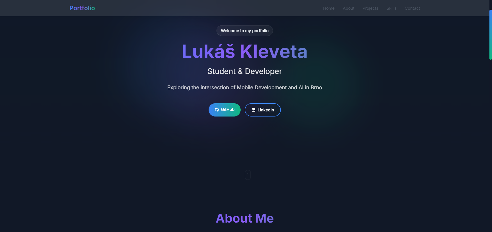

# Personal Portfolio Website

A modern, responsive portfolio website built with React, Vite, and Tailwind CSS. Features a clean design with smooth animations and interactive elements.



## 🚀 Features

- **Modern UI Design**: Clean and professional interface with smooth animations
- **Responsive Layout**: Fully responsive design that works on all devices
- **Dark Theme**: Sleek dark theme with gradient accents
- **Interactive Projects Carousel**: Showcase of projects with detailed information
- **Smooth Animations**: Page transitions and scroll animations using Framer Motion
- **Contact Form**: Interactive contact form with validation
- **Performance Optimized**: Fast loading times and optimal performance

## 🛠️ Technologies Used

- **React** - Frontend framework
- **Vite** - Build tool and development server
- **Tailwind CSS** - Utility-first CSS framework
- **Framer Motion** - Animation library
- **React Slick** - Carousel component
- **React Intersection Observer** - Scroll animations
- **EmailJS** - Email service integration

## 🏗️ Project Structure

```
personal-website/
├── src/
│   ├── components/         # React components
│   ├── assets/            # Images and static files
│   ├── styles/            # CSS and Tailwind styles
│   └── utils/             # Utility functions
├── public/                # Public assets
└── package.json          # Dependencies and scripts
```

## 🚦 Getting Started

1. **Clone the repository**
   ```bash
   git clone https://github.com/Deatrix09/personal-web.git
   cd personal-web
   ```

2. **Install dependencies**
   ```bash
   npm install
   ```

3. **Start development server**
   ```bash
   npm run dev
   ```

4. **Build for production**
   ```bash
   npm run build
   ```

## 📱 Component Features

### Home Section
- Animated introduction text
- Particle background effects
- Social media links

### About Section
- Professional summary
- Skill set visualization
- Download CV button

### Projects Section
- Interactive project carousel
- Project details modal
- Live demo and source code links

### Contact Section
- Interactive contact form
- Email integration
- Social media links

## 🎨 Customization

1. **Colors**: Edit the color scheme in `tailwind.config.js`
2. **Content**: Update personal information in respective components
3. **Projects**: Modify project data in the Projects component
4. **Styling**: Customize CSS in the styles directory

## 📄 License

This project is open source and available under the [MIT License](LICENSE).

## 🤝 Contributing

Contributions, issues, and feature requests are welcome! Feel free to check [issues page](https://github.com/Deatrix09/personal-web/issues).

## 📬 Contact


Project Link: [https://github.com/Deatrix09/personal-web](https://github.com/Deatrix09/personal-web)

## 🙏 Acknowledgments

- [React Documentation](https://reactjs.org/)
- [Tailwind CSS](https://tailwindcss.com/)
- [Framer Motion](https://www.framer.com/motion/)
- [React Slick](https://react-slick.neostack.com/)
